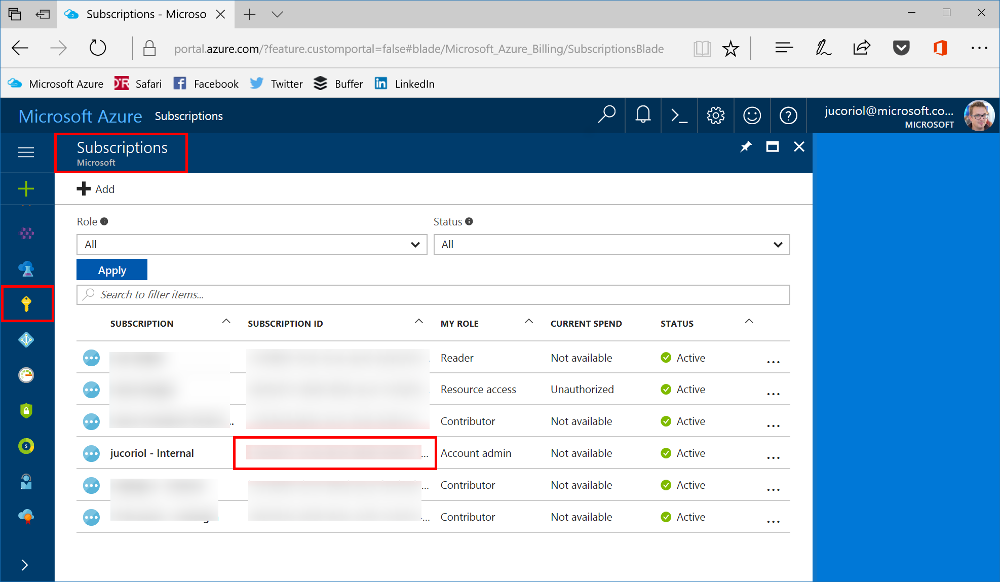
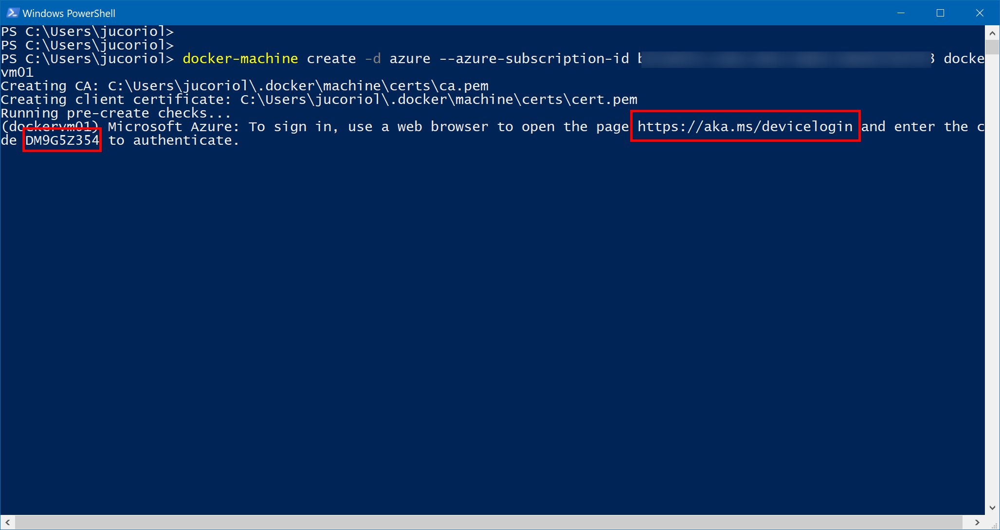
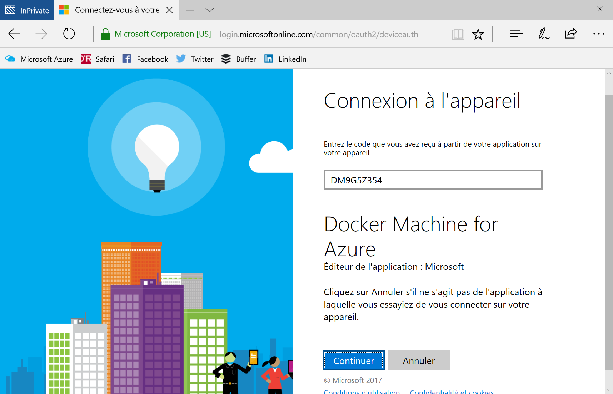
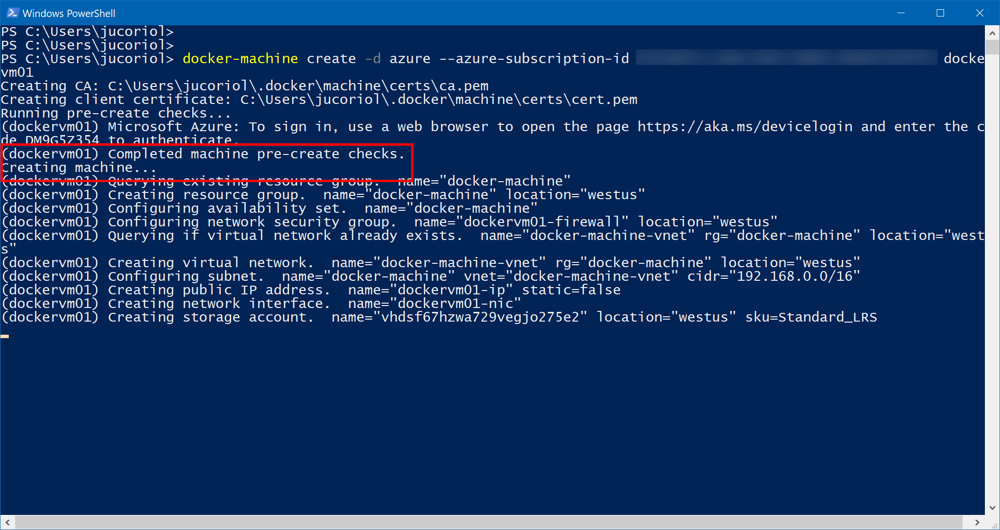
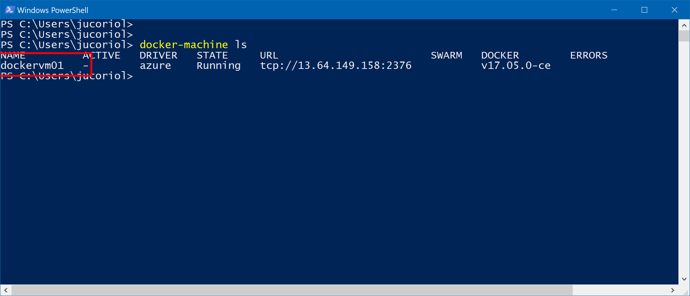
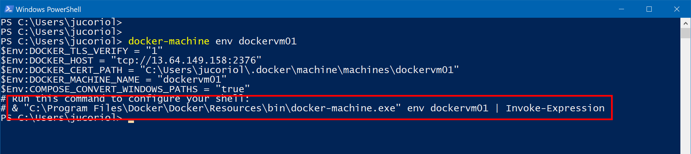
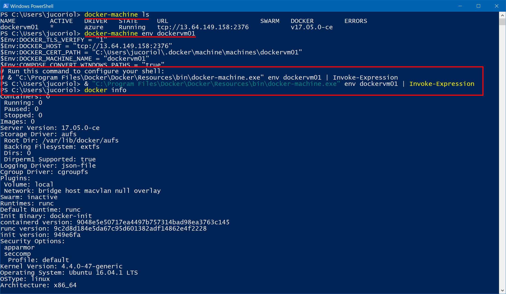
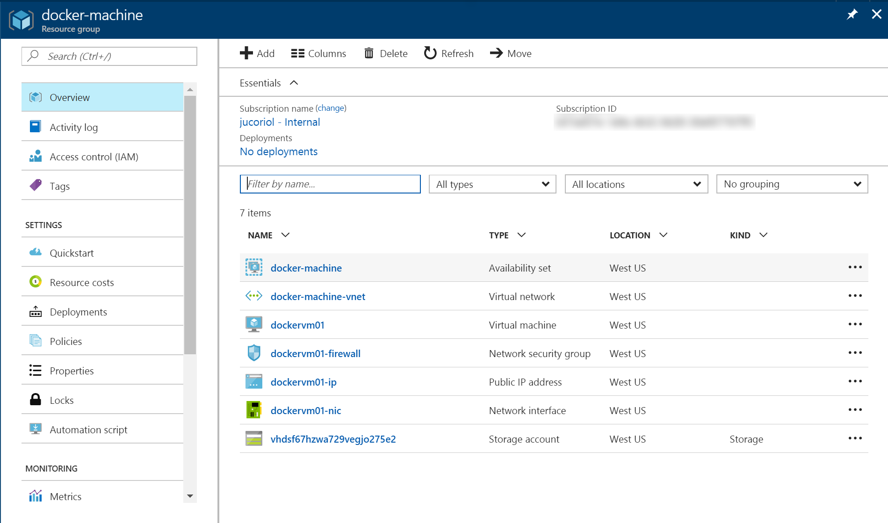

# Use Docker Machine to deploy Docker-enabled virtual machine on Microsoft Azure

[Docker Machine](https://docs.docker.com/machine/overview/) is a tool that helps to create and manage Docker hosts without regarding the platform those machines are running on. It provides built-in a driver that helps to deploy Docker virtual machine on Microsoft Azure.

## Install Docker Machine

Depending on the system you are running on, there are several ways to get Docker Machine:

1. [Docker for Windows](https://docs.docker.com/docker-for-windows/install/) for Windows 10 users
2. [Docker for Mac](https://docs.docker.com/docker-for-mac/install/) for MacOS users (read [that](https://docs.docker.com/docker-for-mac/install/#what-to-know-before-you-install) before installing)
3. [Docker Toolbox](https://docs.docker.com/toolbox/overview/) for other Windows & Mac users
4. Download the [latest release from GitHub](https://github.com/docker/machine/releases/tag/v0.11.0)

## Create a Docker machine on Azure

Once you have the Docker Machine binary on your machine, you can get started with it.
To be able to deploy on Microsoft Azure, you need to provide the identifier of your Azure subscription. 

Browse the [Azure portal](https://portal.azure.com/?feature.customportal=false#blade/Microsoft_Azure_Billing/SubscriptionsBlade) and copy the id of the subscription you want to work with:




Now you can simply ask for a new virtual machine with Docker installed using the following command:

```bash
docker-machine create -d azure --azure-subscription-id SUBSCRIPTION_ID VM_NAME
```

You will be asked to go to [https://aka.ms/devicelogin](https://aka.ms/devicelogin) and use the code provided to authenticate to your Microsoft Azure Subscription:







Once authenticated the creation procedure will resume:



Wait until the process is completed.

*Note: if you want to have fine grained control on some creation options for your virtual machine, for example the name of the resource groupe, the location, etc... you can get all the options for the Azure driver using:*

```bash
docker-machine create -d azure --help
```

## Work with your Docker machine in Azure

You can browse the machines that are managed by Docker Machine using:

```bash
docker-machine ls
```




The you can get all the information to connect to your machine using the command:

```bash
docker-machine env VM_NAME
```



Then you just have to copy/past the command returned by Docker Machine env to your shell and it will define all the environment variables you need to work with the virtual machine.




Finally, if you want to enter an SSH session into the virtual machine, you can use:


```bash
docker-machine ssh VM_NAME
```

Your new Docker machine in Microsoft Azure is ready to work !

If you go to the [Azure portal](https://portal.azure.com) you can browse a resource group named `docker-machine` that contains all the resources that have been created by Docker Machine:



