## 1. Create your Microsoft Azure account

*If you already have a Microsoft Azure account that you can use for the hands-on-lab, you can skip this step.*

Open a new **In Private** or **Incognito** browser session and go to <https://www.microsoftazurepass.com>

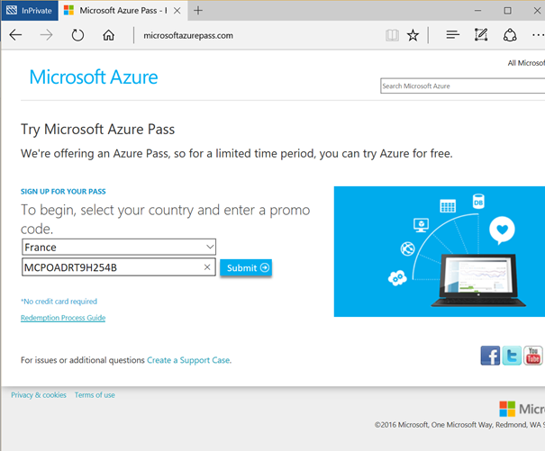

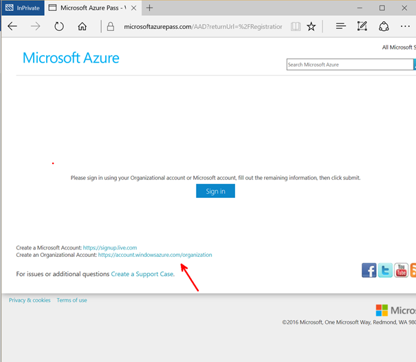

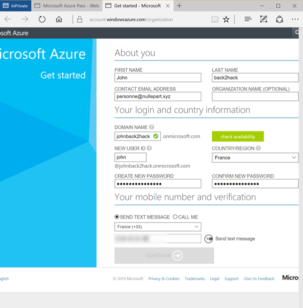

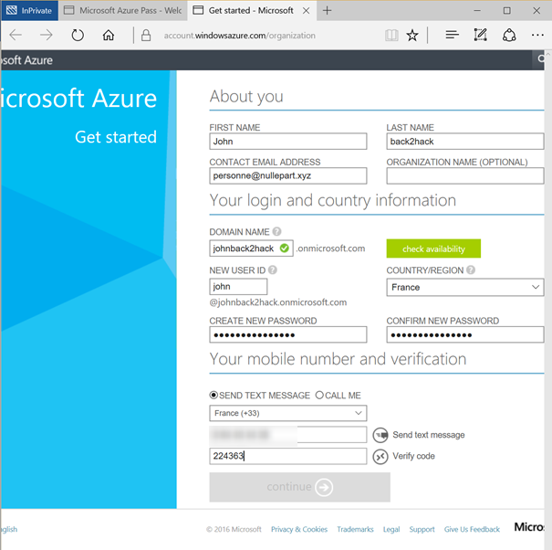

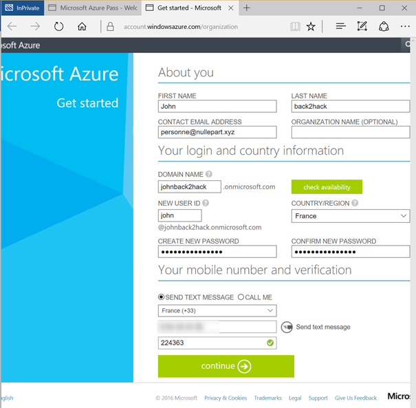

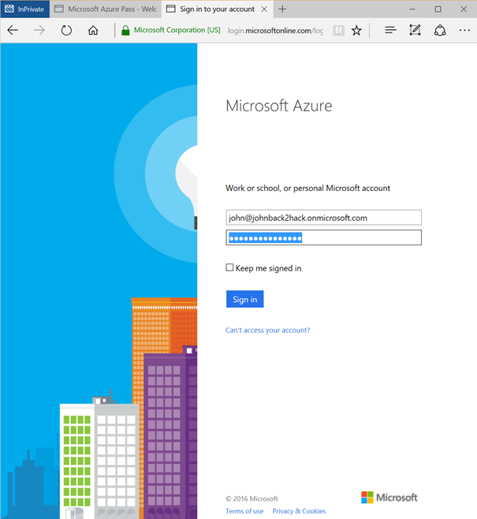

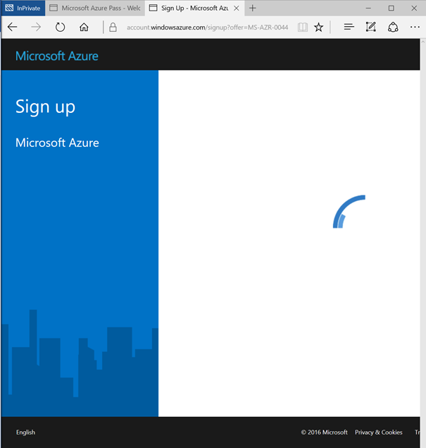

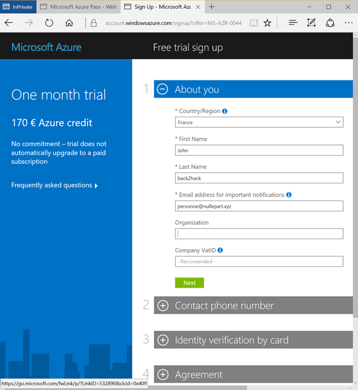

Close the tab on the right (it would lead you to free trial that asks for a Credit Card), 
and use the first tab to continue on with your newly created organizational account.

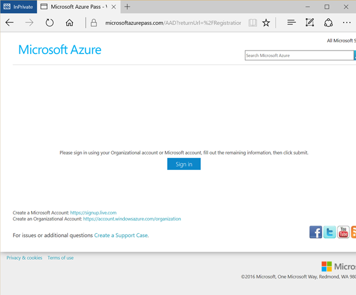

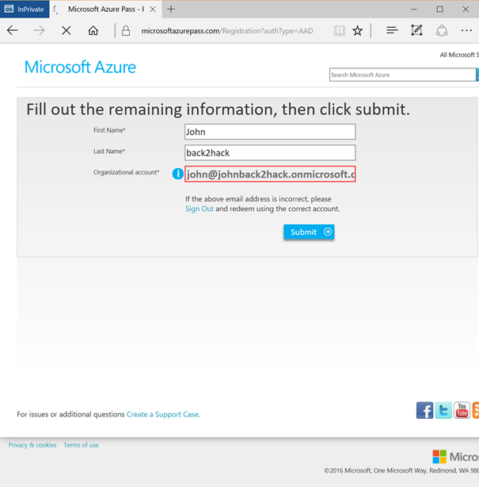

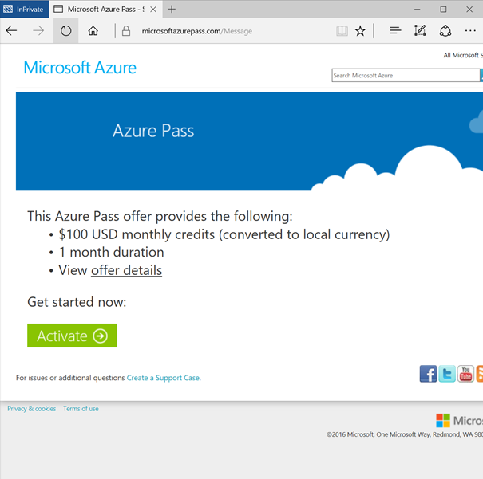

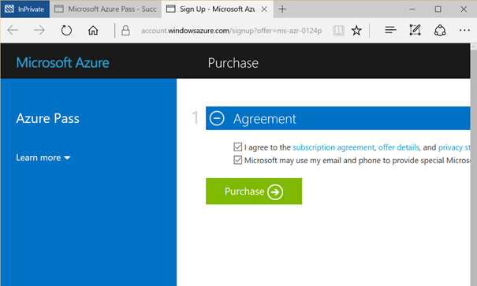

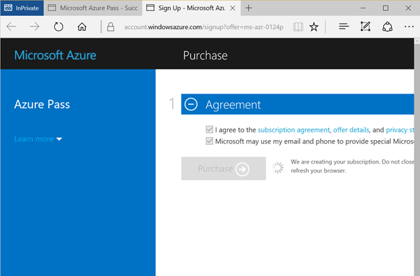

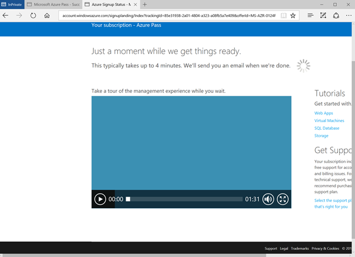

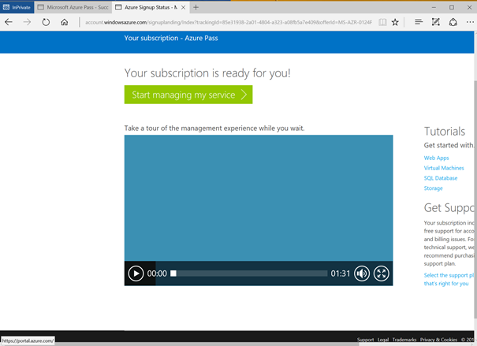

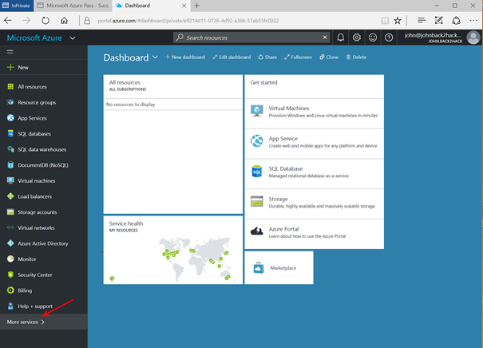

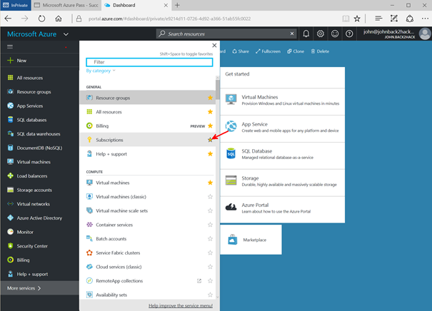

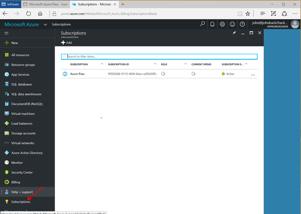

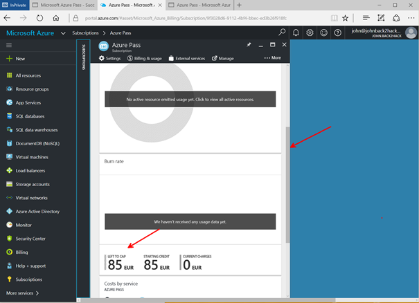

Your Microsoft Azure account is now ready.

